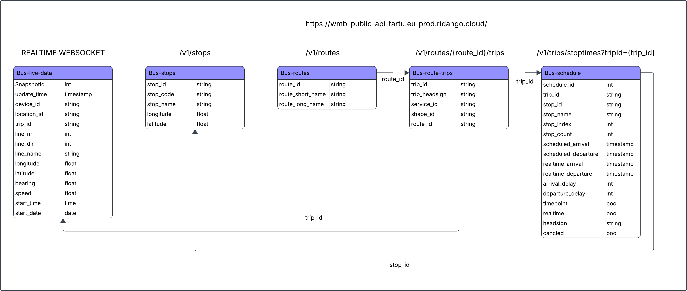

# Tartu Transit Analytics using live bus data and live weather data

In the repository, there are following files:
* Python-scripts for accessing live bus data ([bus_live_data.py](https://github.com/merettearula1/data-engineering-team-13/blob/main/bus_live_data.py)) and live weather ([SIIA ON PYTHONI KOODI VAJA]())
* Sample data snapshots of raw live bus data [sample_bys_data_snapshot.json](https://github.com/merettearula1/data-engineering-team-13/blob/main/sample_bus_data_snapshot.json) and raw live weather data [SIIA ON SNAPSHOTI VAJA]().
* Data Dictionary of the star schema [Data_dictionary.md](https://github.com/merettearula1/data-engineering-team-13/blob/main/Data_dictionary.md)
* SQL Demo Queries base don the project's Business Questions [Demo_queries.md](https://github.com/merettearula1/data-engineering-team-13/blob/main/Demo_queries.md)

## Data Sources

### Public Transport

Bus movement and schedule data is queried from [tartu.pilet.ee] (https://tartu.pilet.ee/et/explore?selectedTab=routes) and is used to describe:

* Bus locations and movements
* Bus stops
* Routes
* Scheduled trips and times

### Weather

Weather observations are retrieved from [ilmateenistus.ee](https://www.ilmateenistus.ee/teenused/ilmainfo/eesti-vaatlusandmed-xml/). The project uses observations from the Tartu-Tõravere weather station.

The data gets updated after every 10 or 60 minutes, depending on the measured parameter. There are total of 19 columns.

| Column | Description | Data Type | Sample value |
| :--- | :--- | :--- | :--- |
| `name` | Station name. | String / Text | Virtsu |
| `wmocode` | Station WMO code. | Integer | 26128 |
| `longitude` | Station longitude coordinate. | Float / Decimal | 23.51355555534363 |
| `latitude` | Station latitude coordinate. | Float / Decimal | 58.572674999100215 |
| `phenomenon` | Weather phenomenon occurring at the station; if absent, cloud cover degree (if measured). If visibility is over 2 km, cloud data is provided in case of mist (if cloudiness is measured). Updated every 10 minutes. | String / Text | Light snowfall |
| `visibility` | Visibility (km). Updated 10 minutes past every hour. | Float / Decimal | 34.0 |
| `precipitations` | Precipitation (mm) during the last hour. Snow, sleet, hail, and similar precipitation amounts are also presented in millimeters of water equivalent (1 cm of snow ~ 1 mm of water). Updated 10 minutes past every hour. | Float / Decimal | 0 |
| `airpressure` | Air pressure (hPa). Standard pressure is 1013.25 hPa. Updated 10 minutes past every hour. | Float / Decimal | 1005.4 |
| `relativehumidity` | Relative humidity (%). Updated 10 minutes past every hour. | Integer | 57 |
| `airtemperature` | Air temperature (°C). Updated every 10 minutes for meteorological stations and 10 minutes past every hour for hydrometeorological stations. | Float / Decimal | -3.6 |
| `winddirection` | Wind direction (°). Updated every 10 minutes. | Integer | 101 |
| `windspeed` | Average wind speed (m/s). Updated every 10 minutes. | Float / Decimal | 3.2 |
| `windspeedmax` | Maximum wind speed / gusts (m/s). Updated every 10 minutes. | Float / Decimal | 5.1 |
| `waterlevel` | Inland water level (cm) relative to Amsterdam Ordnance Datum (NAP). Updated 10 minutes past every hour. | Integer | -49 |
| `waterlevel_eh2000` | Sea water level (cm) relative to Amsterdam Ordnance Datum (EH2000/NAP). Updated 10 minutes past every hour. | Integer | -28 |
| `watertemperature` | Water temperature (°C). Updated 10 minutes past every hour. | Float / Decimal | -0.2 |
| `uvindex` | UV index. Updated every 10 minutes. | Float / Decimal | 3.2 |
| `sunshineduration` | Daily sunshine duration (minutes) on the query date (cumulative data). Updated every 10 minutes. | Integer | 63 |
| `globalradiation` | Global solar radiation, 1-hour average (W/m²). Updated 10 minutes past every hour. | Integer | 207 |

## Data Dictionary
The project's Data Dictionary can be found [here](https://github.com/merettearula1/data-engineering-team-13/blob/main/Data_dictionary.md).

---
This project is developed as part of the Data Engineering 2026/27 fall course at the University of Tartu.
